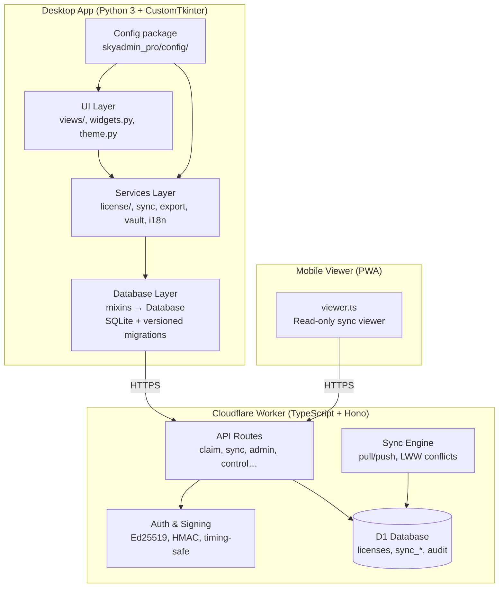

# Architecture

SkyAdmin Pro is a **Windows-first desktop app** (Python 3 + CustomTkinter + SQLite)
backed by a **Cloudflare Worker** (TypeScript + Hono + D1) for licensing, remote
control, and encrypted multi-device sync. It is **not** a mobile-native product;
the Worker also hosts a read-only PWA viewer.



## Component Responsibilities

| Component | Technology | Responsibility |
|-----------|------------|----------------|
| UI Layer | CustomTkinter | Views, widgets, theme, lazy tabs, CanvasScrollFrame |
| Services | Python | License verify, sync client, export redaction, vault, i18n |
| Database | SQLite + mixins | Local data, FTS5, versioned `db/migrations/` |
| Config | `skyadmin_pro/config/` | Version, pricing defaults, settings keys |
| API Routes | Hono (TypeScript) | HTTP endpoints, validation, rate limits |
| Auth & Signing | Web Crypto | Ed25519 licenses, HMAC sessions, constant-time compare |
| Sync Engine | TypeScript | Device register, hashed tokens + TTL, LWW push |
| D1 | Cloudflare D1 | Licenses, control list, sync rows, admin audit |
| PWA Viewer | Vanilla JS | Mobile read-only sync surface |

## Key paths

```
skyadmin_pro/
  ui/views/          # Dashboard, Database Tasks, Company Details, Settings, Document Hub
  ui/widgets.py      # DatePickerField, FormField, themed controls
  ui/canvas_scroll.py
  services/          # license, data_sync, export, secret_fields, auto_backup
  db/                # Database mixins + migrations/
  config/            # APP_VERSION and settings keys

skyadmin-worker/
  src/routes/        # claim, sync, admin/, control, …
  migrations/        # D1 versioned SQL (0001→0004+)
  schema.sql         # End-state reference only (do not db:init)
```

## Data Flow

```
Desktop App                    Cloudflare Worker               D1 Database
    │                               │                              │
    ├── POST /api/generate ────────►│── INSERT issued_licenses ───►│
    │◄── { license_key, passcode }──│                              │
    │                               │                              │
    ├── POST /api/sync/register ───►│── store token_hash + TTL ───►│
    │◄── { sync_token } ────────────│                              │
    │                               │                              │
    ├── POST /api/sync/push ───────►│── upsert sync_rows ─────────►│
    │◄── { conflicts } ─────────────│                              │
    │                               │                              │
    ├── GET /api/sync/pull ────────►│── SELECT changes ───────────►│
    │◄── { rows } ──────────────────│                              │
    │                               │                              │
    ├── GET /api/control ──────────►│── signed text/plain ────────►│
    │◄── SKYCTRL2 envelope ─────────│                              │
    │                               │                              │
    ├── POST /api/claim ───────────►│── burn nonce ───────────────►│
    │◄── { license_key } ───────────│                              │
```

## Sync scope notes

- Tables with `global_id` sync across devices (see `data_sync.py` / `sync_schema.ts`).
- **`client_groups` sync** via stable `global_id`; numeric `clients.group_id` stays local and is remapped from `group_global_id` on pull/push.
- Sync tokens are SHA-256 hashed at rest; missing `expires_at` fails closed.

## UI architecture notes

- Prefer **one scroll surface** per tab; keep `ThemedTreeview` **outside** `CanvasScrollFrame`.
- Lazy sub-tabs: Company Details, Document Hub, Settings (General eager; other Settings tabs on first visit).
- Date pickers use transient `Toplevel` at screen coordinates (never clipped inside scrollers).

## Security Layers

```
┌─────────────────────────────────────────┐
│  TLS (Cloudflare edge)                  │
├─────────────────────────────────────────┤
│  CORS (same-origin credentials)         │
├─────────────────────────────────────────┤
│  CSP (default-src 'none' + script nonce)│
├─────────────────────────────────────────┤
│  Auth (Bearer and/or session + CSRF)    │
├─────────────────────────────────────────┤
│  Rate limiting (per-IP)                 │
├─────────────────────────────────────────┤
│  Timing-safe comparison                 │
├─────────────────────────────────────────┤
│  Parameterized SQL / fail-closed crypto │
└─────────────────────────────────────────┘
```

## Related docs

- [API_REFERENCE.md](API_REFERENCE.md) — endpoint contracts
- [DEPLOYMENT.md](DEPLOYMENT.md) — Worker + desktop ship path
- [WORKER_ADMIN.md](WORKER_ADMIN.md) — admin UI auth split
- [MASTER_ROADMAP.md](MASTER_ROADMAP.md) — audit + backlog
- [FEATURES_AND_UPGRADE_PLAN.md](FEATURES_AND_UPGRADE_PLAN.md) — product features + upgrade plan
- [../AGENTS.md](../AGENTS.md) — subagent orchestration
