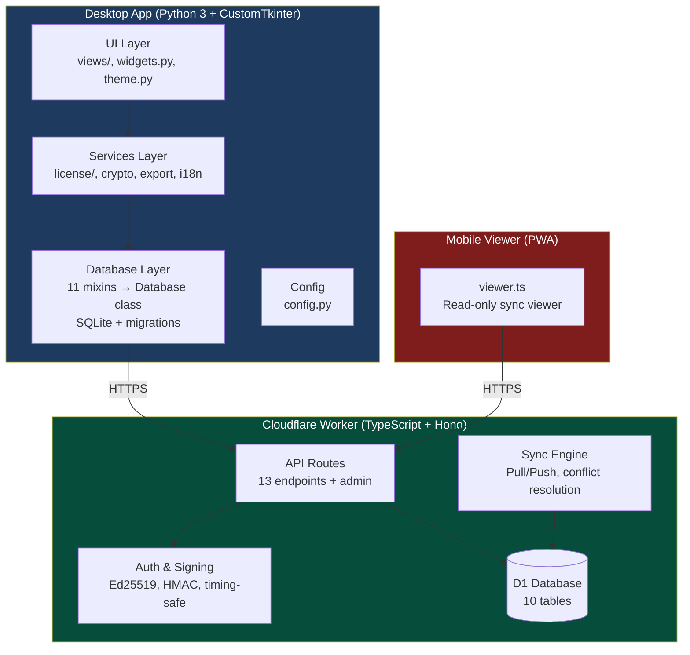

# Architecture



## Component Responsibilities

| Component | Technology | Responsibility |
|-----------|-----------|----------------|
| UI Layer | CustomTkinter | Views, widgets, theme, drag-and-drop |
| Services | Python | License verification, crypto, export, i18n, workflow |
| Database | SQLite + 11 mixins | Data storage, migrations, queries |
| Config | Python constants | App settings, pricing, service types |
| API Routes | Hono (TypeScript) | HTTP endpoints, request validation |
| Auth & Signing | Web Crypto API | Ed25519, HMAC, constant-time comparison |
| Sync Engine | TypeScript | LWW conflict resolution, device registration |
| D1 | Cloudflare D1 | Server-side SQLite (license storage, sync, control) |
| PWA Viewer | Vanilla JS | Mobile read-only sync viewer |

## Data Flow

```
Desktop App                    Cloudflare Worker               D1 Database
    │                               │                              │
    ├── POST /api/generate ────────►│── INSERT issued_licenses ───►│
    │◄── { license_key, passcode }──│                              │
    │                               │                              │
    ├── POST /api/sync/push ───────►│── INSERT/UPDATE clients ────►│
    │                               │── INSERT/UPDATE documents ──►│
    │◄── { conflicts, version } ────│                              │
    │                               │                              │
    ├── GET /api/sync/pull ────────►│── SELECT changes ───────────►│
    │◄── { rows, version } ────────│                              │
    │                               │                              │
    ├── POST /api/claim ───────────►│── Ed25519 verify ───────────►│
    │◄── { license_key } ──────────│── INSERT used_nonces ───────►│
```

## Security Layers

```
┌─────────────────────────────────────────┐
│  TLS (Cloudflare edge)                  │
├─────────────────────────────────────────┤
│  CORS (same-origin credentials)         │
├─────────────────────────────────────────┤
│  CSP (default-src 'none')               │
├─────────────────────────────────────────┤
│  Auth (Bearer token / session cookie)   │
├─────────────────────────────────────────┤
│  CSRF (HMAC tokens)                     │
├─────────────────────────────────────────┤
│  Rate limiting (per-IP)                 │
├─────────────────────────────────────────┤
│  Timing-safe comparison                 │
├─────────────────────────────────────────┤
│  Parameterized SQL                      │
└─────────────────────────────────────────┘
```
