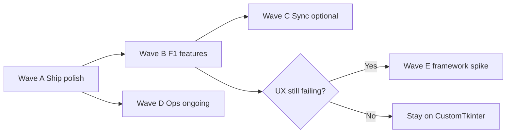

# SkyAdmin Pro — Features & Upgrade Plan

**Version baseline:** `0.3.3`  
**Stack:** Python 3 + CustomTkinter + SQLite · Cloudflare Worker (TypeScript/Hono) + D1  
**Status:** Phases 7–11, S1 hardening, and residual sprint **P0–P3** are landed. This document inventories **what the product does today** and the **ordered plan to upgrade** next.

Related: [MASTER_ROADMAP.md](MASTER_ROADMAP.md) · [ARCHITECTURE.md](ARCHITECTURE.md) · [ROADMAP.md](ROADMAP.md) · [AGENTS.md](../AGENTS.md)

---

## 1. Product features (detailed)

### 1.1 Desktop — core workspace

| Feature | What users get | Primary paths |
|---------|----------------|---------------|
| **Dashboard** | Stat cards first; progressive detail trees (expiry, pending, overdue, suppliers, ongoing, reports, tax overview) | `ui/views/dashboard.py` |
| **Database & Tasks** | Clients, tasks, suppliers, tax cycles; active-tab-only refresh; FTS5 client search | `ui/views/database_tasks/` |
| **Company Details** | Lazy sub-tabs: Accounting, General, Tax IDs, Filing, VO/CSH, Financial Docs; forms scroll, trees outside scroll | `ui/views/company_details/` |
| **Document Hub** | Folder/document workflows; lazy panels; poll pauses when hidden | `ui/views/document_hub/` |
| **Settings** | Appearance, license, business defaults, checklist/pricing, backup; General eager, other tabs lazy | `ui/views/settings/` |
| **Global search** | Cross-entity find | `ui/views/global_search.py` |
| **Audit log dialog** | Desktop audit viewer entry from Settings | `ui/views/audit_log.py` |

### 1.2 Desktop — data & ops

| Feature | What users get | Notes |
|---------|----------------|-------|
| **SQLite local DB** | Full offline-capable firm data | Versioned `db/migrations/` |
| **Client groups** | Named categories with soft-delete | Synced via `client_groups.global_id` + `group_global_id` on clients |
| **Credentials / vault** | Encrypted secrets at rest | Fail-closed decrypt |
| **Export / reports** | Excel/report paths with secret redaction | `services/export.py` |
| **Backup / restore** | Manual + auto-backup; restore closes pool before overwrite | `db/core.py`, `auto_backup` |
| **Multi-language** | UI language setting + translate helpers | `services/i18n.py` |
| **Workspace paths** | Clients/suppliers folders under configured root | Settings → General |

### 1.3 Licensing & updates

| Feature | What users get | Notes |
|---------|----------------|-------|
| **Ed25519 licenses** | Signed keys / passcodes; machine-bound | Desktop verify + Worker generate |
| **Activation claim** | Burn nonce via `/api/claim` | Rate-limited |
| **Online checks** | Ban/revoke/control list via signed `/api/control` | Rate-limited |
| **Auto-update channel** | Worker publishes installer URL (`SkyAdminPro-Setup-*.exe`) | Tag release fail-closed without API token |
| **Remote pricing** | Packages from Worker | Admin can POST pricing |

### 1.4 Sync

| Feature | What users get | Notes |
|---------|----------------|-------|
| **Device register** | Activation code → sync token | Rejects banned/revoked/**expired** |
| **Pull / push** | LWW conflicts logged | Tokens hashed + TTL; pull/push rate-limited |
| **Encrypted credentials** | `sync_device.json` encrypted at rest | Plaintext migrates on read |
| **Mobile viewer** | Read-only PWA over sync | `viewer.ts` |

### 1.5 Worker / admin

| Feature | What users get | Notes |
|---------|----------------|-------|
| **Admin HTML** | Generate/revoke/ban/records UI | Session cookie + CSRF; CSP |
| **JSON API** | Bearer **or** same-origin cookie+CSRF | See `API_REFERENCE.md` |
| **Admin audit log** | D1 `admin_audit_log` + 30-day purge | Login/dashboard |
| **D1 migrations** | `0001`…`0004+` | `schema.sql` reference only |

### 1.6 Packaging & CI

| Feature | What ship path does |
|---------|---------------------|
| PyInstaller + Inno Setup | Portable + installer (`SkyAdminPro-Setup-{ver}.exe`) |
| Release workflow | Windows build ∥ Worker Vitest → publish needs both; installer update URL |
| Deploy workflow | Test → migrate → deploy; **concurrency** group `skyadmin-worker-deploy` |
| `release_check.py` | Version, exe, installer (skippable), Worker HTTP smoke, pytest |

---

## 2. Landed hardening (do not re-open)

Treat as **done** unless regressions appear:

- Timing-safe admin/API compares; sync TTL; CSP; token hashing (`token_hash`)
- Trees outside scroll; Settings checklist single scroll; DatePicker Toplevel/grab; Dashboard progressive trees
- Filing history expandable row; Settings lazy tabs
- Release `needs: worker`; installer auto-update URL; tag fail-closed on missing token
- `_migrate_*` wrappers removed; auth docs corrected
- `deploy.yml` concurrency
- Wave C: `client_groups` sync (schema v2), pull pagination, conflict review polish

---

## 3. Upgrade plan (ordered)

### Wave A — Ship polish (1–2 weeks) · **near-term**

| ID | Item | Owner | Done when |
|----|------|-------|-----------|
| A1 | Manual QA on clean PC (`MANUAL_QA.md` + `UI_CHECKLIST.md`) | Human + `qa-verifier` | ⚠️ Automated gates green; **manual checklist still human** |
| A2 | Tag release dry-run with secrets present | `packaging-release` | ⚠️ `release_check` RELEASE OK; **no `SKYADMIN_API_TOKEN` in local env**; commit dirty tree then tag `v0.3.3` (see §6) |
| A3 | Optional GitHub Environment `production` on `deploy.yml` | Ops | Concurrency landed; Environment remains optional |
| A4 | Measure Dashboard first interactive paint | `ui-performance` | ✅ `tests/test_dashboard_paint.py` (+ `SKYADMIN_DASHBOARD_PAINT=1`) |

### Wave B — Product features F1 (2–3 weeks) · **landed in tree**

| ID | Feature | Detail | Owner | Status |
|----|---------|--------|-------|--------|
| F1.1 | **Scheduled auto-backup UX** | Retention copy, Open AutoBackups folder, scheduler nudge + toast | `ui-performance` | ✅ |
| F1.2 | **Keyboard shortcuts** | Ctrl+F search, Ctrl+N new client, Ctrl+S contextual save | `ui-performance` | ✅ |
| F1.3 | **Bulk client operations** | Multi-select → status / group / archive (soft-delete) | `desktop-core` | ✅ |
| F1.4 | **Client grouping UX** | Local-only labels; group CRUD polish | `desktop-core` | ✅ |
| F1.5 | **Richer audit surfaces** | Tax cycle + sync conflicts in Audit log | `desktop-core` | ✅ |
| F1.6 | **Print-ready reports** | Dashboard Export PDF + tax overview; export redaction | `desktop-core` | ✅ |

**Gate:** Do not start F1 until A1–A2 are green for the target tag.

### Wave C — Sync & multi-device · **landed in tree**

| ID | Item | Why | Status |
|----|------|-----|--------|
| C1 | Sync `client_groups` with stable `global_id` | Cross-device groups | ✅ m011 + `group_global_id` wire remap; numeric `group_id` still excluded |
| C2 | Sync pull pagination UX | Large tenants | ✅ Desktop loops `limit` pages; status shows page count |
| C3 | Conflict review UI | Operators need to see LWW skips | ✅ Table filter, copy Global ID, refresh |

### Wave D — Platform & ops (ongoing)

| ID | Item | Owner |
|----|------|-------|
| D1 | macOS notarization / Linux packaging polish | `packaging-release` |
| D2 | Staging Worker + D1 (separate wrangler env) before prod deploy | `worker-api` + ops |
| D3 | SAST / deeper dependency gates already partial in CI — keep green | `packaging-release` |
| D4 | Deeper Dashboard SQL ≤3 rewrite (optional; budget already ≤40/1 conn) | `desktop-core` |

### Wave E — Framework rewrite (**last resort**)

Only if residual CustomTkinter UX still fails after Waves A–B:

- Evaluate Qt / Electron with a **spike**, not a full rewrite
- Keep Worker + SQLite schema contracts stable
- See `PLATFORM.md` for historical options

---

## 4. Feature → acceptance matrix (next ship)

| Capability | Automated | Manual |
|------------|-----------|--------|
| License activate / ban / expire | Vitest + pytest | MANUAL_QA |
| Sync register / pull / push | Vitest | Two-PC smoke |
| Company Details Filing history usable on tall monitors | `test_canvas_scroll` | UI_CHECKLIST 1100×700 + 1920×1080 |
| Settings first open snappy | (lazy tabs) | Open Settings → License/Business/Data |
| Tag publish | CI | Confirm installer URL in update API |
| Worker deploy | CI concurrency | Ping smoke |

---

## 5. Suggested execution timeline



**Now:** Wave A **human** MANUAL_QA / UI_CHECKLIST, then **tag release** (see §6) when secrets ready.  
**Landed:** Wave B F1.1–F1.6 + Wave C C1–C3 in tree.  
**Next:** Wave D ops / human QA.  
**Avoid:** Re-doing landed security/UI/CI work; baking new columns into applied D1 `0001`.

---

## 6. Versioning & release cadence

1. Commit the dirty tree (P0–P3 + Waves A–C product work). Exclude `.qa_smoke_shots/`, local profile backups, and secrets.
2. Bump `pyproject.toml` version if needed (single source of truth) — suggested next tag **`0.3.3`** for Wave C sync schema v2.
3. `python scripts/release_check.py` → RELEASE OK (needs network for Worker smoke).
4. Ensure GitHub secret `SKYADMIN_API_TOKEN` is set (release job is **fail-closed** if empty).
5. Tag and push:
   ```bash
   git tag -a v0.3.3 -m "SkyAdmin Pro 0.3.3"
   git push origin HEAD
   git push origin v0.3.3
   ```
6. After Worker migrations that rebuild `sync_devices`, plan a **re-register** support note.
7. Run `docs/MANUAL_QA.md` on a clean PC before treating the publish as final.

---

## 7. Doc index for upgrades

| Doc | Use |
|-----|-----|
| This file | Feature inventory + upgrade waves |
| MASTER_ROADMAP | Historical audit + checkboxes |
| ARCHITECTURE | System diagram |
| API_REFERENCE | Contracts |
| DEPLOYMENT | Ops deploy |
| CONTRIBUTING / AGENTS | How to change code safely |
