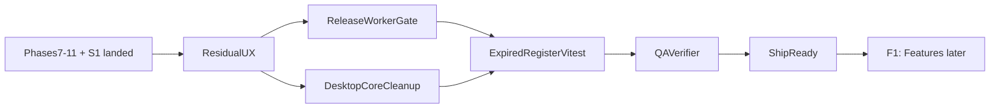

# SkyAdmin Pro — Master Roadmap & Audit

Comprehensive analysis of **features, security, code quality, optimization, loading, UI/UX, testing, documentation, and architecture**.

**Current version:** `0.3.2` · **Primary platform:** Windows desktop · **Stack:** Python 3 + CustomTkinter + SQLite + TypeScript Cloudflare Worker

---

## Table of Contents

1. [Project Health Dashboard](#1-project-health-dashboard)
2. [Security Audit](#2-security-audit)
3. [Performance & Optimization](#3-performance--optimization)
4. [UI/UX Analysis](#4-uiux-analysis)
5. [Code Quality](#5-code-quality)
6. [Testing Coverage](#6-testing-coverage)
7. [Features & Architecture](#7-features--architecture)
8. [Documentation](#8-documentation)
9. [CI/CD & DevOps](#9-cicd--devops)
10. [Implementation Phases](#10-implementation-phases)
11. [Success Metrics](#11-success-metrics)

---

## 1. Project Health Dashboard

| Area | Score | Key Gap |
|------|-------|---------|
| **Security** | 8/10 | S1 hardening landed (timing-safe auth, sync TTL, CSP); residual: expired-register Vitest, auth doc wording |
| **Performance** | 7/10 | Dashboard first-paint still heavy; SQLite pooling deferred; trees still inside Company Details scroll |
| **UI/UX** | 7.5/10 | DatePicker polish; Settings nested scroll; Company Details tree/scroll fight |
| **Code Quality** | 7/10 | Hybrid `_migrate_*` left in `core.py`; config.py bloat; bare excepts |
| **Testing** | 7/10 | Expired sync register Vitest missing; vault/ciphertext-at-rest thin |
| **Features** | 8/10 | Ed25519 licensing, sync, export, multi-language — solid foundation |
| **Documentation** | 7.5/10 | Good roadmap/deploy docs, missing API reference and SECURITY.md |
| **CI/CD** | 7.5/10 | Release publish does not `needs: worker`; Windows signing supported |

**Overall: 7.5/10** — Phases 7–11 + S1 landed; residual UX/CI/core backlog remains (see Quick Wins NEXT).

### File Inventory

| Category | Count | Lines (est.) |
|----------|-------|--------------|
| Python `skyadmin_pro/` | 119 files | ~14,000 |
| TypeScript `skyadmin-worker/src/` | 42 files | ~3,000 |
| Tests (pytest + vitest) | 47 files | ~4,500 |
| Build/CI/packaging | 25 files | ~1,500 |
| Documentation | 15 files | ~2,000 |
| **Total** | **248 files** | **~25,000** |

---

## 2. Security Audit

### 2.1 Critical Vulnerabilities

> **Status:** S1–S6 hardening below is **landed**. Do **not** re-implement timing-oracle, sync-TTL, or CSP work as greenfield P0. Residual security/test work is in [Quick Wins NEXT](#quick-wins-1-3-days-each-do-anytime).

| # | Issue | File:Line | Severity | Status |
|---|-------|-----------|----------|--------|
| S1 | Admin password compared with `===` (timing oracle) | `worker/src/routes/admin/handler.ts` | **CRITICAL** | ✅ Fixed — constant-time compare |
| S2 | Session token compared with `===` (timing oracle) | `worker/src/routes/admin/session.ts` | **CRITICAL** | ✅ Fixed — constant-time compare |
| S3 | Auth middleware fallback degrades to `===` | `worker/src/auth.ts` | **HIGH** | ✅ Fixed — fail closed without `crypto.subtle` |
| S4 | Sync tokens never expire (no TTL column) | `worker/src/sync_auth.ts` + D1 | **HIGH** | ✅ Fixed — TTL + rotation |
| S5 | API_TOKEN embedded in admin page DOM | `worker/src/routes/admin/pages.ts` | **HIGH** | ✅ Mitigated / cookie+CSRF path |
| S6 | No Content-Security-Policy on admin/viewer pages | `admin/pages.ts`, `viewer.ts` | **HIGH** | ✅ Fixed — CSP on HTML responses |

### 2.2 High-Severity Issues

| # | Issue | File:Line | Fix |
|---|-------|-----------|-----|
| S7 | No rate limiting on admin login endpoint | `admin/handler.ts` | Add per-IP rate limit (use `claim.ts` pattern) |
| S8 | No rate limiting on pricing/update POST | `routes/pricing.ts`, `routes/update.ts` | Add per-IP rate limits |
| S9 | Hardcoded Ed25519 dev key in `.dev.vars.example` | `.dev.vars.example:11` | Label as "TEST KEY ONLY" with warning |
| S10 | `rate_limits` table grows unbounded (no cleanup) | `routes/claim.ts`, `routes/sync.ts` | Add periodic cleanup on every Nth request |
| S11 | `login_attempts` cleanup only on failed login | `admin/session.ts:65-67` | Clean on successful login too |
| S12 | SQL interpolation of LIMIT in sync pull | `routes/sync.ts:132` | Cast to integer before interpolation; use parameterized query |
| S13 | `subprocess.Popen` with user-influenced paths | `services/file_ops.py:196-198` | Validate path is a file (not executable/script) before opening |

### 2.3 Medium-Severity Issues

| # | Issue | File:Line | Fix |
|---|-------|-----------|-----|
| S14 | XOR obfuscation in `config.py` and `_secret.py` | `config.py:122-322`, `_secret.py:11-21` | Acceptable for obfuscation; document as non-security-boundary |
| S15 | Sync credentials legacy plaintext fallback | `services/data_sync.py:86-91` | Log warning on plaintext read; re-encrypt immediately |
| S16 | No HTTPS certificate pinning | `data_sync.py:242`, `license/verify.py:514` | Acceptable for desktop app; document as accepted risk |
| S17 | CORS allows `*` for null origin (file://) | `worker/src/cors.ts:11-12` | Document as intentional for desktop app |
| S18 | HMAC integrity seal truncated to 64 bits | `services/_protect_core.py:78` | Use full HMAC; performance impact negligible |
| S19 | Thread-unsafe `_current_lang` global | `services/i18n.py:59` | Add threading lock |

### 2.4 Low-Severity / Hardening

| # | Issue | File | Fix |
|---|-------|------|-----|
| S20 | Debugger detection easy to bypass | `license/machine.py:13-35` | Standard anti-debug; acceptable |
| S21 | `pyarmor.bug.log` in repo root | root | Add to `.gitignore` |
| S22 | No `Strict-Transport-Security` header | Worker | Cloudflare edge adds this; no action needed |
| S23 | Dead `@ts-ignore` branch in auth.ts | `auth.ts:16-19` | Remove dead code |

---

## 3. Performance & Optimization

### 3.1 Desktop App (Python)

| # | Issue | File:Line | Impact | Fix |
|---|-------|-----------|--------|-----|
| P1 | **New SQLite connection per query** | `db/core.py:40-72` | **HIGH** — WAL/pragmas re-set on every query | Use connection pool or singleton with thread-local storage |
| P2 | **`dashboard_snapshot()` opens 12+ connections** | `db/tax.py:158-179` | **MEDIUM** — noticeable latency on slow disks | Wrap entire snapshot in single connection |
| P3 | **`apply_form_theme()` recursive walk on view switch** | `ui/widgets.py:142-165` | **MEDIUM** — walks 100+ widgets | Cache theme state; skip if already applied |
| P4 | **`_bind_wheel_recursive()` O(n) widget walk** | `ui/canvas_scroll.py:60-72` | **MEDIUM** — triggered on content changes | Debounce more aggressively; cache widget list |
| P5 | **Global `ttk.Style` mutation on every treeview** | `ui/treeview.py:77-195` | **LOW** — called multiple times per refresh | Apply theme once per refresh cycle, not per treeview |
| P6 | **`translate.py` modifies global socket timeout** | `services/translate.py:41-56` | **LOW** — race condition in parallel calls | Use per-request timeout or `requests` library |
| P7 | **`list_service_types()` cache not invalidated externally** | `db/clients.py:234` | **LOW** — stale cache if DB written directly | Acceptable for desktop; document assumption |

### 3.2 Worker API (TypeScript)

| # | Issue | File:Line | Impact | Fix |
|---|-------|-----------|--------|-----|
| P8 | **`recordsHandler` full table scan of revocations + used_nonces** | `routes/records.ts:24-29` | **HIGH** — O(N) per request as lists grow | Use JOINs or EXISTS subqueries |
| P9 | **Dynamic `import()` in hot path** | `routes/generate.ts:25-27` | **MEDIUM** — overhead per generate request | Move to static top-level imports |
| P10 | **`summarizeMachines` hardcoded LIMIT 2000** | `routes/records.ts:54-55` | **LOW** — incomplete summaries for large installs | Make configurable or paginate |
| P11 | **No D1 query error handling in most routes** | `routes/generate.ts:53-55` | **MEDIUM** — license returned before DB insert confirmed | Move return after DB write succeeds |

### 3.3 Database

| # | Issue | File | Impact | Fix |
|---|-------|------|--------|-----|
| P12 | **Monolithic `_migrate()` (187 lines)** | `db/core.py:209-395` | **HIGH** — runs on every startup | Remove monolith; rely on versioned migrations |
| P13 | **40+ indexes — review for redundancy** | `db/schema.py` | **LOW** — indexes are well-targeted | Audit on 500+ client threshold |
| P14 | **FTS5 already implemented** | `db/clients.py` | ✅ Done | — |
| P15 | **Virtual scrolling threshold at 60 rows** | `ui/treeview.py:13` | ✅ Well-tuned | — |
| P16 | **Batch sync push on Worker** | `sync_push.ts` | ✅ Done | — |
| P17 | **Composite indexes for overdue/ongoing** | `db/migrations/m008` | ✅ Done | — |

---

## 4. UI/UX Analysis

### 4.1 DatePickerField Issues

| # | Issue | File:Line | Fix |
|---|-------|-----------|-----|
| U1 | Root-level `<Button-1>` and `<Escape>` bindings conflict with multiple instances | `widgets.py:635-638` | Track all open popups at class level; single root binding dispatches correctly |
| U2 | `_try_grab` after 80ms is fragile | `widgets.py:803-814` | Use `update()` + immediate grab after Toplevel creation |
| U3 | `-topmost` flicker (set then cleared after 200ms) | `widgets.py:798-799` | Use transient relationship with parent instead of `-topmost` |
| U4 | Scroll position not accounted for in popup anchor | `widgets.py:527-546` | Toplevels are already above parent; verify with CanvasScrollFrame |

### 4.2 Dashboard

| # | Issue | File:Line | Fix |
|---|-------|-----------|-----|
| U5 | First paint still heavy — defer more of `build()` cost | `dashboard.py` | ← **NEXT** — keep stat cards; heavy widgets later |
| U6 | Fingerprint comparison can miss stale data (same count, different tasks) | `dashboard.py:50-87` | Include row IDs in fingerprint, not just counts |
| U7 | Three-stage deferred refresh is complex but correct | `dashboard.py:682-913` | ✅ Good pattern; simplify if bugs arise |

### 4.3 Company Details

| # | Issue | File:Line | Fix |
|---|-------|-----------|-----|
| U8 | **7-mixin inheritance** — MRO complexity | `company_details/panel.py:37-46` | Consider composition over inheritance; at minimum document MRO |
| U9 | Redundant 3-layer refresh dispatch | `panel.py:244-302` | Consolidate `_*_mutation()` methods into single parameterized method |
| U10 | Private `_views` attribute accessed across modules | `panel.py:930-932`, `dashboard.py:1092` | Add public `get_view(name)` method on MainWindow |
| U11 | String-based tab name dispatch (fragile to typos) | `database_tasks/view.py`, `company_details/panel.py` | Use constants or enum for tab names |

### 4.4 Document Hub

| # | Issue | File:Line | Fix |
|---|-------|-----------|-----|
| U12 | 3-second polling always active (when visible) | `document_hub/view.py:142-158` | ✅ Correctly paused in `on_hide()`; acceptable |
| U13 | Polling includes disk I/O (os.listdir + stat) | `document_hub/view.py:147-152` | Acceptable for local files; cache if network drives |

### 4.5 Treeview & Scrolling

| # | Issue | File:Line | Fix |
|---|-------|-----------|-----|
| U14 | Virtual scrollbar position may jump on rapid scroll | `treeview.py:289-297` | Acceptable; virtual scroll inherently approximate |
| U15 | Treeview inside CanvasScrollFrame gets double wheel handling | `canvas_scroll.py:82-95` | ✅ Already handled with class check |

### 4.6 Theme

| # | Issue | File:Line | Fix |
|---|-------|-----------|-----|
| U16 | `apply_form_theme()` called on every view switch | `main_window.py:283` | Cache themed widgets; skip if already themed |
| U17 | Global `ttk.Style` mutation | `treeview.py:77-195` | Single source of truth is correct; avoid multiple calls |

### 4.7 Positive UX Patterns

- ✅ Active-tab-only refresh prevents refresh storms
- ✅ Lazy panel creation in Database & Tasks, Document Hub, Company Details
- ✅ Virtual scrolling at 60-row threshold with incremental updates at 20
- ✅ CanvasScrollFrame smoother than CTkScrollableFrame
- ✅ Debounced search (300ms) in clients and document hub
- ✅ Dashboard fingerprinting prevents unnecessary tree rebuilds
- ✅ Three-stage deferred refresh keeps UI responsive
- ✅ Empty states on trees, loading states on sync/backup
- ✅ High-DPI scaling bootstrap

---

## 5. Code Quality

### 5.1 Critical Issues

| # | Issue | File:Line | Fix |
|---|-------|-----------|-----|
| Q1 | **100+ bare `except Exception: pass`** across UI code | `widgets.py`, `display.py`, `canvas_scroll.py`, `treeview.py`, `main_window.py` | Narrow to specific exceptions; add logging for crypto/file operations |
| Q2 | **`config.py` is ~1000 lines** of constants | `config.py` | Split into domain-specific modules (licensing, pricing, UI, service types) |
| Q3 | **Duplicate constants** across license modules | `license/_constants.py:5-12` vs `license/machine.py:41-48` | Import from `_constants.py` instead of redefining |
| Q4 | **`_fetch_all`/`_fetch_one` in wrong mixin** | `db/clients.py:329-337` | Move to `CoreMixin` |

### 5.2 Medium Issues

| # | Issue | File:Line | Fix |
|---|-------|-----------|-----|
| Q5 | `__import__("sys")` inline instead of top-level import | `treeview.py:130-133` | Replace with `import sys` at module level |
| Q6 | `__import__()` used in 9+ locations | `data_sync.py`, `treeview.py`, `backup_mixin.py`, `settings/view.py` | Replace with proper top-level imports |
| Q7 | Dynamic SQL string interpolation in sync | `data_sync.py:363-375,414-466` | Acceptable (trusted constants); add comment documenting assumption |
| Q8 | Mixed import patterns (`from __future__` + `TYPE_CHECKING` inconsistent) | Various | Standardize across codebase |
| Q9 | `vo_csh_rollout.py` duplicated inference logic | `vo_csh_rollout.py:77-116` | Refactor single-client variant to call multi-client with filter |

### 5.3 Strengths

- ✅ Parameterized SQL queries (no SQL injection in practice)
- ✅ Atomic file writes (temp + rename pattern)
- ✅ Zip Slip prevention in `crypto.py`
- ✅ Fail-closed secrets in `secret_fields.py`
- ✅ Export redaction with `FORBIDDEN_EXPORT_COLUMNS`
- ✅ Ruff linting with comprehensive rule set
- ✅ TypeScript strict mode
- ✅ Clean module boundaries in Worker API

---

## 6. Testing Coverage

### 6.1 Current Coverage

| Category | Python Tests | Worker Tests | Status |
|----------|-------------|--------------|--------|
| Security/Crypto | 5 files | 3 files | ✅ Good |
| License/Activation | 2 files | 2 files | ✅ Good |
| Data Sync | 1 file | 2 files | ✅ Good |
| Database | 2 files | — | ✅ Good |
| UI Smoke/Layout | 6 files | — | ⚠️ Moderate |
| Feature Rollout | 5 files | — | ✅ Good |
| Performance | 1 file | — | ⚠️ Needs expansion |
| Release | 1 file | — | ✅ Good |
| **Total** | **36 files** | **11 files** | |

### 6.2 Missing Tests (Priority Order)

| # | Gap | Priority | Files to Create |
|---|-----|----------|-----------------|
| T1 | Admin session flow (login/logout/CSRF) | **P0** | `worker/src/admin.test.ts` |
| T2 | Rate limiting (claim, sync register, admin login) | **P0** | `worker/src/rate_limit.test.ts` |
| T3 | Integration test: generate → claim → verify | **P1** | `worker/src/integration.test.ts` |
| T4 | Revoke, ban, used, records handlers | **P1** | `worker/src/handlers.test.ts` |
| T5 | CORS behavior | **P2** | `worker/src/cors.test.ts` |
| T6 | `file_ops.py` utilities | **P2** | `tests/test_file_ops.py` |
| T7 | `i18n.py`, `translate.py` | **P2** | `tests/test_i18n.py` |
| T8 | Visual regression for UI | **P3** | `tests/test_visual_regression.py` |
| T9 | Worker full HTTP lifecycle | **P3** | `tests/test_worker_lifecycle.py` |
| T10 | Pricing POST endpoint | **P2** | `worker/src/pricing.test.ts` |

---

## 7. Features & Architecture

### 7.1 Feature Inventory

| Feature | Status | Quality | Notes |
|---------|--------|---------|-------|
| License/Activation (Ed25519) | ✅ Complete | High | Claim burn, control list, machine binding |
| Data Sync (Pull/Push) | ✅ Complete | High | LWW conflicts, conflict audit, column allowlist |
| Desktop UI (CustomTkinter) | ✅ Complete | Good | 6 main views, lazy loading, virtual scrolling |
| Cloudflare Worker API | ✅ Complete | High | 20+ endpoints, Hono framework, D1 |
| Export (Excel) | ✅ Complete | Good | Atomic writes, column redaction |
| Document Hub | ✅ Complete | Good | 6 tool panels, async operations |
| Office Hub | ✅ Complete | Good | Contacts, notebook, vault, setup |
| Multi-language (EN/MY/TH) | ✅ Complete | Good | UI translations, snippet packs |
| PWA Viewer | ✅ Complete | Good | Mobile sync viewer |
| Tax Calendar | ✅ Complete | Good | Monthly SOP, filing tracking |
| Inno Setup Installer | ✅ Complete | Good | Windows code signing support |
| CI/CD Pipeline | ✅ Complete | Good | Lint + test + release workflow |
| Auto-update | ✅ Complete | Good | Worker-published version + download URL |
| Backup/Restore (Encrypted) | ✅ Complete | High | Fernet encryption, retention policy |
| Clipboard/Print Utilities | ✅ Complete | Good | pyperclip integration |

### 7.2 Feature Gaps

| # | Feature | Priority | Effort | Impact |
|---|---------|----------|--------|--------|
| F1 | **macOS native build + notarization** | P1 | Medium | Cross-platform reach |
| F2 | **Linux native build** | P2 | Medium | Cross-platform reach |
| F3 | **Scheduled auto-backup** (daily/weekly) | P1 | Low | Data safety |
| F4 | **Bulk client operations** (select multiple, batch status change) | P2 | Medium | Power user productivity |
| F5 | **Print-ready reports** (PDF generation from dashboard) | P2 | Medium | Client deliverables |
| F6 | **Dark/light theme toggle** | P3 | Low | User preference |
| F7 | **Keyboard shortcuts** (Ctrl+S, Ctrl+Z, etc.) | P2 | Low | Power user UX |
| F8 | **Undo/redo** for form edits | P3 | High | Data safety |
| F9 | **Client grouping/categorization** | P2 | Medium | Organization |
| F10 | **Audit log viewer** (tax_cycle_log, sync_conflicts) | P2 | Low | Transparency |

### 7.3 Architecture Assessment

**Current Architecture:**
```
Desktop App (Python 3 + CustomTkinter)
    ├── UI Layer (15 files, ~10,000 lines)
    │   ├── views/ (6 main views, ~8,500 lines)
    │   ├── widgets.py (shared components, 1,046 lines)
    │   └── treeview.py, canvas_scroll.py, theme.py
    ├── Services Layer (23 files, ~5,000 lines)
    │   ├── license/ (5 files, machine/online/verify)
    │   ├── crypto, data_sync, export, workflow
    │   └── i18n, snippets, tracking, tax_calendar
    ├── Database Layer (25 files, ~3,900 lines)
    │   ├── 11 mixins → Database class
    │   ├── schema.py (18 tables, 40+ indexes)
    │   └── migrations/ (8 versioned migrations)
    └── Config (config.py, 1,000+ lines)

Cloudflare Worker (TypeScript + Hono)
    ├── Routes (13 endpoints + 4 admin)
    ├── Core (15 modules: auth, signing, sync, etc.)
    ├── D1 Database (10 tables, 9 indexes)
    └── Tests (11 files, ~628 lines)
```

**Architecture Strengths:**
- Clean separation: UI → Services → Database
- Domain-driven DB mixins
- Versioned migration framework
- Worker API has clear module boundaries
- Lazy view loading prevents startup bottleneck

**Architecture Weaknesses:**
- `config.py` is a monolith (1,000+ lines)
- `CompanyDetailsPanel` has 7 mixins (MRO complexity)
- Private `_views` attribute accessed across modules
- String-based tab dispatch (no type safety)
- No dependency injection (tight coupling to `self.app.db`)

---

## 8. Documentation

### 8.1 Existing Documentation

| Document | Path | Status |
|----------|------|--------|
| Roadmap | `docs/ROADMAP.md` | ✅ Comprehensive (Phases 7-11) |
| Worker Deploy | `skyadmin-worker/DEPLOY.md` | ✅ Good |
| Manual QA | `docs/MANUAL_QA.md` | ✅ Exists |
| UI Checklist | `docs/UI_CHECKLIST.md` | ✅ Good |
| Phase 4 Walkthrough | `docs/PHASE4_WALKTHROUGH.md` | ✅ Exists |
| Platform Strategy | `docs/PLATFORM.md` | ✅ Exists |
| Worker Admin | `docs/WORKER_ADMIN.md` | ✅ Exists |
| CHANGELOG | `CHANGELOG.md` | ✅ Exists |
| README | `README.md` | ✅ Exists |
| Agent Instructions | `AGENTS.md` | ✅ Excellent |

### 8.2 Missing Documentation

| # | Document | Priority | Purpose |
|---|----------|----------|---------|
| D1 | **SECURITY.md** | **P0** | Vulnerability reporting process, security policies |
| D2 | **API Reference** | **P1** | Route-by-route spec for Worker endpoints |
| D3 | **CONTRIBUTING.md** | **P2** | Contributor guidelines |
| D4 | **Architecture Diagram** | **P2** | Visual system architecture (mermaid) |
| D5 | **Database Schema Reference** | **P2** | Table relationships, index purposes |
| D6 | **Deployment Runbook** | **P2** | Step-by-step production deployment |

---

## 9. CI/CD & DevOps

### 9.1 Current Pipeline

```
Push to main → CI (Python lint + test + Worker typecheck + test)
Tag v* → Release (build + sign + installer + release_check + GitHub Release + Worker publish)
```

### 9.2 Pipeline Gaps

| # | Gap | Priority | Fix |
|---|-----|----------|-----|
| C0 | Release publish does not wait on Worker job | P0 | `windows-release` / publish `needs: [worker]` ← **NEXT** |
| C1 | No code signing in CI for non-Windows builds | P1 | Add macOS/Linux signing steps |
| C2 | No dependency vulnerability scanning | P1 | Add `pip-audit` and `npm audit` steps |
| C3 | No integration tests in CI | P2 | Add Worker lifecycle test |
| C4 | No performance regression gate | P2 | Add perf test with threshold |
| C5 | No Docker-based testing | P3 | Add container for reproducible tests |
| C6 | No security scanning (SAST) | P2 | Add `bandit` for Python, `semgrep` for TypeScript |

---

## 10. Implementation Phases

### Phase S1 — Security Hardening — **DONE** (do not re-open as P0)

| # | Task | Files | Agent | Status |
|---|------|-------|-------|--------|
| S1.1 | Fix timing oracle on admin password comparison | `admin/handler.ts` | `worker-api` | ✅ Done |
| S1.2 | Fix timing oracle on session/CSRF validation | `admin/session.ts` | `worker-api` | ✅ Done |
| S1.3 | Remove auth middleware `===` fallback | `auth.ts` | `worker-api` | ✅ Done |
| S1.4 | Add sync token TTL | `sync_auth.ts`, D1 schema | `worker-api` | ✅ Done |
| S1.5 | Add admin login rate limiting | `admin/handler.ts` | `worker-api` | ✅ Done |
| S1.6 | Add CSP headers to admin/viewer pages | `admin/pages.ts`, `viewer.ts` | `worker-api` | ✅ Done |
| S1.7 | Label dev key as TEST-ONLY | `.dev.vars.example` | `worker-api` | ✅ Done |
| S1.8 | Add `rate_limits` table cleanup | `routes/claim.ts`, `routes/sync.ts` | `worker-api` | ✅ Done |

### Phase S2 — Security Testing — **mostly landed**; residual Vitest in NEXT

| # | Task | Files | Agent | Done when |
|---|------|-------|-------|-----------|
| S2.1 | Admin session flow tests | `admin.test.ts` (new) | `worker-api` | Login/logout/CSRF tested |
| S2.2 | Rate limiting tests | `rate_limit.test.ts` (new) | `worker-api` | Claim, sync, admin limits tested |
| S2.3 | CORS behavior tests | `cors.test.ts` (new) | `worker-api` | All origin scenarios tested |
| S2.4 | Worker integration test | `integration.test.ts` (new) | `worker-api` | Generate → claim → verify chain |

**Parallel:** S2.1-S2.4 can run as `worker-api` subagent (same tree).

### Phase P1 — Performance (residual + deferred)

| # | Task | Files | Agent | Status |
|---|------|-------|-------|--------|
| P1.1 | Connection pool for SQLite | `db/core.py` | `desktop-core` | **Deferred** — acceptable until measured pain |
| P1.2 | Dashboard snapshot single connection | `db/tax.py` | `desktop-core` | ⚠️ Partial — budget relaxed (≤40 statements / 1 connection); full ≤3 rewrite out of sprint |
| P1.3 | Remove monolithic `_migrate()` / extract remaining `_migrate_*` | `db/core.py`, `db/migrations/` | `desktop-core` | ← **NEXT** (hybrid left) |
| P1.4 | Dashboard first-paint deferral | `ui/views/dashboard.py` | `ui-performance` | ← **NEXT** (stat cards stay; heavy widgets later) |
| P1.5 | Worker `recordsHandler` optimization | `routes/records.ts` | `worker-api` | Later |
| P1.6 | Worker static imports | `routes/generate.ts` | `worker-api` | Later |
| P1.7 | D1 error handling in routes | `routes/generate.ts` | `worker-api` | Later |

### Phase U1 — UI/UX Polish (residual sprint focus)

| # | Task | Files | Agent | Status |
|---|------|-------|-------|--------|
| U1.0a | Company Details: trees outside `CanvasScrollFrame` | `company_details/` | `company-details` + `ui-performance` | ← **NEXT** |
| U1.0b | Settings: remove nested checklist scroll | `settings/view.py` | `ui-performance` | ← **NEXT** |
| U1.1 | DatePickerField polish (root binds, grab, drop `-topmost`) | `widgets.py` | `ui-widgets` | ← **NEXT** (Toplevel + flip-up already landed) |
| U1.2 | Consolidate Company Details refresh | `company_details/panel.py` | `company-details` | Later |
| U1.3 | Add public `get_view()` method | `main_window.py` | `ui-performance` | Later |
| U1.4 | Constants for tab names | `database_tasks/view.py`, `company_details/panel.py` | `ui-performance` | Later |
| U1.5 | Narrow exception handlers in services | `services/*.py` | `desktop-core` | Later |
| U1.6 | Split `config.py` | `config.py` | `desktop-core` | Later |
| U1.7 | Replace `__import__()` calls | 9+ files | `desktop-core` | Later |

**Sequence:** `ui-widgets` then `company-details` if both touch `widgets.py`.

### Phase T1 — Test Expansion (1-2 weeks)

| # | Task | Files | Agent | Done when |
|---|------|-------|-------|-----------|
| T1.1 | `file_ops.py` tests | `tests/test_file_ops.py` (new) | `desktop-core` | Sanitize, merge PDF, archive tested |
| T1.2 | `i18n.py` / `translate.py` tests | `tests/test_i18n.py` (new) | `desktop-core` | Language switch, translation tested |
| T1.3 | Worker handler tests (revoke, ban, records) | `handlers.test.ts` (new) | `worker-api` | All CRUD handlers tested |
| T1.4 | Pricing POST tests | `pricing.test.ts` (new) | `worker-api` | Pricing update tested |
| T1.5 | Performance regression tests | `test_performance_*.py` | `qa-verifier` | Dashboard query count + client search <100ms |

**Parallel:** T1.1-T1.2 (`desktop-core`) and T1.3-T1.4 (`worker-api`) and T1.5 (`qa-verifier`) can all run simultaneously.

### Phase D1 — Documentation (1 week)

| # | Task | Files | Agent | Done when |
|---|------|-------|-------|-----------|
| D1.1 | **SECURITY.md** | `SECURITY.md` (new) | `desktop-core` | Vulnerability reporting process documented |
| D1.2 | **API Reference** | `docs/API_REFERENCE.md` (new) | `worker-api` | All endpoints documented with examples |
| D1.3 | **Architecture diagram** | `docs/ARCHITECTURE.md` (new) | `desktop-core` | Mermaid diagram of system components |
| D1.4 | **CONTRIBUTING.md** | `CONTRIBUTING.md` (new) | `desktop-core` | Contributor guidelines |

**Parallel:** D1.1-D1.4 can all run simultaneously (different files).

### Phase R1 — Release & Operations (residual + later)

| # | Task | Files | Agent | Status |
|---|------|-------|-------|--------|
| R1.0 | Gate tag release / Worker publish on Worker Vitest (`needs: worker`) | `.github/workflows/release.yml` | `packaging-release` | ← **NEXT** |
| R1.1 | macOS notarization script | `packaging/build-macos.sh` | `packaging-release` | Later (Windows installer remains primary) |
| R1.2 | Linux build script improvements | `packaging/build-linux.sh` | `packaging-release` | Later |
| R1.3 | Dependency vulnerability scanning in CI | `.github/workflows/ci.yml` | `packaging-release` | Later |
| R1.4 | Security scanning (SAST) in CI | `.github/workflows/ci.yml` | `packaging-release` | Later |
| R1.5 | Worker D1 migration framework | `worker/src/migrations/` | `worker-api` | Later |

### Phase F1 — Feature Additions (2-3 weeks) — **AFTER SECURITY + PERFORMANCE**

| # | Task | Files | Agent | Done when |
|---|------|-------|-------|-----------|
| F1.1 | Scheduled auto-backup | `services/backup.py` | `desktop-core` | Daily/weekly backup with notification |
| F1.2 | Keyboard shortcuts | `ui/main_window.py` | `ui-performance` | Ctrl+S, Ctrl+Z, Ctrl+N, Ctrl+F |
| F1.3 | Bulk client operations | `ui/views/database_tasks/clients_panel.py` | `ui-performance` | Select multiple, batch status change |
| F1.4 | Client grouping/categorization | `db/clients.py`, UI | `desktop-core` | Group clients by type/status |
| F1.5 | Audit log viewer | `ui/views/settings/` | `company-details` | View tax_cycle_log, sync_conflicts |
| F1.6 | Print-ready reports | `services/export.py` | `desktop-core` | PDF generation from dashboard data |

---

## 11. Success Metrics

### Security

| Metric | Target | Current |
|--------|--------|---------|
| Admin auth timing-safe | 100% of comparisons constant-time | ✅ Landed (`timingSafeEqual`) |
| Sync token TTL | All tokens expire within 30 days | ✅ Landed |
| CSP headers | All HTML responses have CSP | ✅ Landed |
| Rate limiting | All write endpoints rate-limited | ⚠️ Partial (claim, sync register, admin) |

### Performance

| Metric | Target | Current |
|--------|--------|---------|
| SQLite connections per query | 1 (pooled) | ❌ New connection per query |
| Dashboard SQL round-trips | ≤3 per refresh | ⚠️ ~12 (snapshot) |
| Dashboard first render | <500ms | ⚠️ Not measured |
| Database Tasks first open | <500ms | ✅ (lazy loading) |

### Testing

| Metric | Target | Current |
|--------|--------|---------|
| pytest pass rate | 100% | ✅ 100% |
| vitest pass rate | 100% | ✅ 100% |
| Worker test files | 15+ | ⚠️ 11 |
| Python test files | 40+ | ⚠️ 36 |
| Integration tests | At least 1 full cycle | ❌ None |

### Code Quality

| Metric | Target | Current |
|--------|--------|---------|
| Ruff lint errors | 0 | ✅ 0 |
| TypeScript strict | No errors | ✅ No errors |
| Bare `except Exception` | <20 (from 100+) | ❌ 100+ |
| `config.py` size | <200 lines per module | ❌ 1,000+ lines |

### Documentation

| Metric | Target | Current |
|--------|--------|---------|
| SECURITY.md | Exists | ❌ |
| API Reference | Exists | ❌ |
| Architecture diagram | Exists | ❌ |
| CONTRIBUTING.md | Exists | ❌ |

---

## Execution Order



**Current priority order (residual sprint — see [AGENTS.md](../AGENTS.md)):**
1. **Company Details trees out of scroll** + Settings nested scroll + DatePicker polish + Dashboard first-paint
2. **Release CI** — publish/`windows-release` must `needs: worker`
3. **Worker** — expired register Vitest; auth doc wording
4. **Desktop-core** — finish `_migrate_*` extract; `group_id` sync allowlist
5. **QA** — pytest + Vitest + `release_check`
6. **Defer** — SQLite pooling; Feature pack F1; framework rewrite
7. **Do not re-do** — timing oracles, sync TTL, CSP, or AGENTS priorities 1–3 (already landed)

---

## Quick Wins (1-3 days each, do anytime)

- [x] Versioned DB migrations (Phase 7.1)
- [x] Dashboard query budget (Phase 7.2)
- [x] Settings integrity banner (Phase 7.3)
- [x] Background thread audit (Phase 7.4)
- [x] Single version source (Phase 7.5)
- [x] Sync register hardening (Phase 8.1)
- [x] Worker route tests (Phase 8.2)
- [x] Encrypt sync_device.json (Phase 8.3)
- [x] Export runtime guard (Phase 8.4)
- [x] CORS review (Phase 8.5)
- [x] Sync token rotation (Phase 8.6)
- [x] Vault tests (Phase 8.7)
- [x] Lazy loading (Phase 9.1-9.3)
- [x] File splits (Phase 9B)
- [x] UX polish (Phase 9C)
- [x] FTS5 search (Phase 10.1)
- [x] Treeview incremental (Phase 10.2)
- [x] Batch sync push (Phase 10.3)
- [x] Composite indexes (Phase 10.4)
- [x] CI release workflow (Phase 11.1)
- [x] Windows code signing (Phase 11.2)
- [x] Changelog generator (Phase 11.5)
- [x] Publish pipeline (Phase 11.6)
- [x] Admin timing oracles / `timingSafeEqual` (S1) — **done; do not re-implement**
- [x] Sync token TTL + rotation (S1) — **done; do not re-implement**
- [x] Admin/viewer CSP (S1) — **done; do not re-implement**
- [x] DatePicker Toplevel + flip-up; Database Tasks active-tab refresh; Company Details lazy sub-tabs — **done**
- [ ] Company Details: trees outside `CanvasScrollFrame` ← **NEXT**
- [ ] Settings: remove nested checklist scroll ← **NEXT**
- [ ] DatePicker polish (multi-instance binds, grab, drop `-topmost`) ← **NEXT**
- [ ] Dashboard first-paint deferral ← **NEXT**
- [ ] Release workflow: publish gated on Worker job (`needs: worker`) ← **NEXT**
- [ ] Vitest: expired eligibility on sync register → 403 ← **NEXT**
- [ ] Extract remaining `_migrate_*` into `db/migrations/` ← **NEXT**
- [ ] Sync allowlist: `clients.group_id` (desktop + Worker) ← **NEXT**
- [ ] SQLite connection pooling — deferred (acceptable until measured pain)
- [ ] SECURITY.md — later (docs phase; not this sprint P0)

---

## Related Docs

- [ROADMAP.md](ROADMAP.md) — Phase 7-11 detail
- [PLATFORM.md](PLATFORM.md) — Cross-platform strategy
- [MANUAL_QA.md](MANUAL_QA.md) — Pre-ship checklist
- [UI_CHECKLIST.md](UI_CHECKLIST.md) — Theme/layout QA
- [PHASE4_WALKTHROUGH.md](PHASE4_WALKTHROUGH.md) — Per-view walkthrough
- [WORKER_ADMIN.md](WORKER_ADMIN.md) — Admin UI split
- [packaging/README.md](../packaging/README.md) — Build & installer
- [AGENTS.md](../AGENTS.md) — Subagent orchestration
